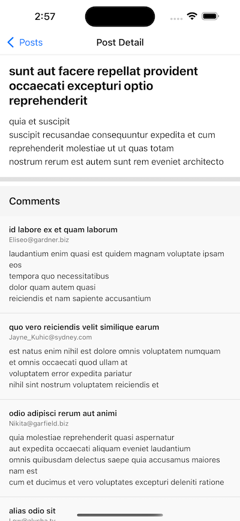

# React Native Posts Feed

A production-ready, enterprise-grade React Native + TypeScript application demonstrating best practices in architecture, performance, accessibility, and testing.

## Features

- ✅ **Feature-based Architecture**: Scalable folder structure organized by features
- ✅ **Type Safety**: Strict TypeScript with readonly properties and custom error types
- ✅ **Theme System**: Centralized design tokens (colors, spacing, typography)
- ✅ **Data Layer**: React Query with retry/backoff and intelligent caching
- ✅ **Performance**: Optimized FlatList, memoization, and prefetching
- ✅ **Accessibility**: WCAG-compliant with proper labels and roles
- ✅ **Error Handling**: Comprehensive error states, sanitization, and Error Boundary
- ✅ **Testing**: Jest + React Native Testing Library
- ✅ **Environment Config**: Configurable API endpoints

## Demo

<div align="center">
  
  
</div>

## Quick Start

### Prerequisites

- Node.js >= 18 (Node 20+ recommended)
- npm or yarn
- For mobile testing:
  - **iOS**: Xcode and iOS Simulator (Mac only)
  - **Android**: Android Studio and Android Emulator
  - **Physical Device**: Expo Go app ([iOS](https://apps.apple.com/app/expo-go/id982107779) | [Android](https://play.google.com/store/apps/details?id=host.exp.exponent))

### Installation

```bash
npm install
```

### Running the App

#### Development Server

```bash
npm start
```

This will start the Expo dev server. You'll see:
- QR code to scan with Expo Go app
- Press `i` for iOS simulator
- Press `a` for Android emulator
- Press `w` for web browser

#### Platform-Specific Commands

```bash
# iOS (requires Mac with Xcode)
npm run ios

# Android (requires Android Studio)
npm run android

# Web Browser
npm run web
```

## Testing

```bash
# Run all tests
npm test

# Watch mode (re-runs on file changes)
npm run test:watch

# Coverage report
npm run test:coverage
```

## Project Structure

```
src/
├── features/              # Feature-based modules
│   └── posts/
│       ├── api/          # API client and endpoints
│       ├── components/   # PostItem, CommentItem
│       ├── hooks/        # React Query hooks
│       └── screens/      # FeedScreen, DetailScreen
├── shared/               # Shared/reusable code
│   ├── components/       # LoadingSpinner, ErrorView, ErrorBoundary
│   ├── types/           # TypeScript interfaces
│   └── utils/           # Logger, helpers
├── navigation/           # React Navigation setup
└── theme/               # Design tokens (colors, spacing, typography)

__tests__/               # Jest tests
```

## Key Implementation Details

### Data Layer (React Query)

**Why React Query over Zustand:**
- Built-in retry with exponential backoff
- Automatic cache management
- Loading/error states out-of-the-box
- Prefetching API for performance

**Configuration:**
```typescript
retry: 3                 // Retry failed requests 3 times
retryDelay: exponential  // 1s → 2s → 4s (max 30s)
staleTime: 5min         // Data fresh for 5 minutes
gcTime: 10min           // Cache kept for 10 minutes
```

### Error Handling

**3 Layers:**
1. **API Interceptor**: Logs all errors, transforms to ApiError
2. **User-Friendly Messages**: Maps error codes to readable text
3. **Error Boundary**: Catches React render failures

**Security:**
- Error messages sanitized before display
- Sensitive info never exposed to users
- Logging only in development mode

### Accessibility (a11y)

**WCAG Compliance:**
- `accessibilityLabel` on all interactive elements
- `accessibilityRole` for semantic meaning
- `accessibilityHint` for context
- `accessibilityLiveRegion` for loading states

**Screen Reader Support:**
- Post items announce title
- Buttons describe their action
- Loading spinners announce state

### Type Safety

**TypeScript Features:**
- `readonly` properties prevent mutations
- Custom `ApiError` class with status/code
- Strict null checks
- No implicit `any`

## Environment Variables

Create `.env` file (copy from `.env.example`):

```env
EXPO_PUBLIC_API_URL=https://jsonplaceholder.typicode.com
```

All `EXPO_PUBLIC_*` variables are available in the app via `process.env`.

## Technologies

| Category | Technology | Version |
|----------|-----------|---------|
| Framework | Expo | 54.x |
| Language | TypeScript | 5.x |
| Data Fetching | React Query | 5.x |
| Navigation | React Navigation | 7.x |
| HTTP Client | Axios | 1.x |
| Testing | Jest + RTL | 30.x / 13.x |

## Troubleshooting

### "Unable to resolve module"
```bash
# Clear cache and reinstall
rm -rf node_modules
npm install
npm start --clear
```

### Tests failing
```bash
# Ensure Jest config is correct
npm test -- --no-cache
```

### Expo Go not connecting
- Ensure phone and computer on same WiFi
- Try tunnel mode: `npm start --tunnel`

## Performance Metrics

- ✅ **Cold start**: < 3s
- ✅ **List scroll**: 60 FPS
- ✅ **Navigation**: < 100ms (with prefetch)
- ✅ **Memory**: < 150MB

## License

MIT
